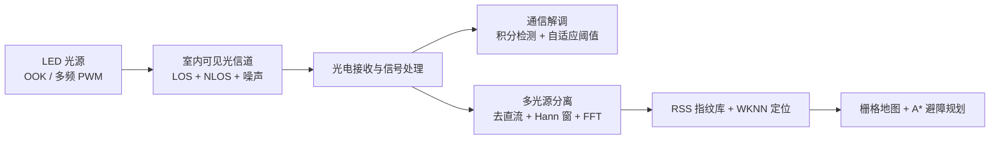

# 可见光通信与室内导航融合仿真

[English](README_EN.md) | 中文

本项目探索可见光通信（VLC）、室内定位与路径规划的融合方案。项目使用
MATLAB 完成通信链路、RSS 指纹定位和避障航迹规划仿真，并使用 STM32
原型验证基础光通信和多频 LED 信号识别。

> 项目定位：校级大学生创新项目原型。完整的“通信-定位-规划”流程主要在
> MATLAB 中实现；硬件部分用于验证基础通信链路与多光源频域分离。

## 系统架构



## 主要内容

- 构建 OOK 可见光通信链路，设计前导码、Barker 同步码、数据载荷和 XOR
  校验组成的数据帧。
- 使用积分检测与自适应阈值改善噪声环境下的 OOK 判决效果。
- 建立包含 Lambertian 辐射、LOS/NLOS 一次反射、散粒噪声和热噪声的
  室内光信道模型。
- 基于多光源 RSS 指纹与 WKNN 算法完成二维位置估计。
- 将估计位置映射到栅格地图，使用 A* 算法规划避障路径。
- 使用 STM32、OPT101、ADC、DMA 和 FFT 验证多频 LED 信号分离方案。

## 仓库结构

```text
.
├── matlab
│   ├── communication
│   │   ├── bpsk_link_demo.mlx
│   │   └── vlc_ook_gui.mlx
│   ├── localization_navigation
│   │   └── vlp_wknn_astar_obstacles.mlx
│   └── apps
│       └── wknn_positioning_app.mlapp
└── docs
    ├── hardware-prototype.md
    └── technical-notes.md
```

## 文件说明

| 文件 | 内容 |
| --- | --- |
| `bpsk_link_demo.mlx` | 基础点对点通信链路与 Barker 码帧同步实验 |
| `vlc_ook_gui.mlx` | OOK 通信、光信道建模、文本及图像分包传输 GUI |
| `vlp_wknn_astar_obstacles.mlx` | 多光源 RSS 指纹定位、障碍物建模与 A* 路径规划 |
| `wknn_positioning_app.mlapp` | WKNN 定位交互界面 |

## 运行环境

- MATLAB R2022b 或更高版本
- Communications Toolbox
- Image Processing Toolbox（运行图像传输演示时需要）

使用 MATLAB 打开对应 `.mlx` Live Script 并运行。首次运行定位导航脚本时，
建议保留默认参数，以便快速生成指纹库、定位误差结果和规划路径。

## 仿真场景

定位导航示例使用 `4 m × 4 m × 4 m` 室内空间、4 个顶部 LED 和
`16 × 16` 参考点网格。系统对比不同 K 值下的 WKNN 定位结果，并将估计位置
作为 A* 路径规划起点。

## 局限性

- 当前定位与路径规划面向静态二维环境，未完成无人机实机闭环控制。
- 可见光链路容易受到遮挡、环境光变化和硬件噪声影响。
- 仓库未包含原 STM32 工程源码，硬件实现细节记录在
  [硬件原型说明](docs/hardware-prototype.md) 中。
