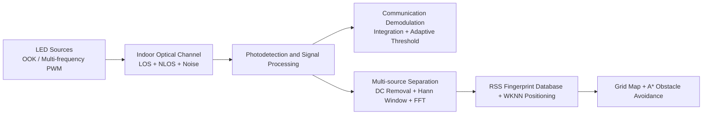

# Visible Light Communication and Indoor Navigation Simulation

English | [中文](README.md)

This project explores an integrated approach to visible light communication
(VLC), indoor positioning, and path planning. MATLAB is used to simulate the
communication link, RSS fingerprint positioning, and obstacle-aware navigation.
An STM32-based prototype was also developed to validate basic optical
communication and multi-frequency LED signal identification.

> Project scope: This is a university-level student innovation project
> prototype. The complete communication-positioning-planning workflow is
> implemented primarily in MATLAB. The hardware prototype validates the basic
> communication link and multi-source frequency-domain separation.

## System Architecture



## Key Features

- Builds an OOK-based VLC link with a frame containing a preamble, Barker
  synchronization code, payload, and XOR checksum.
- Uses integration detection and an adaptive decision threshold to improve OOK
  demodulation under noisy conditions.
- Models an indoor optical channel with Lambertian radiation, LOS and
  first-order NLOS reflection, shot noise, and thermal noise.
- Implements two-dimensional indoor positioning using multi-source RSS
  fingerprints and the Weighted K-Nearest Neighbors (WKNN) algorithm.
- Maps the estimated position onto a grid and uses A* to plan an
  obstacle-avoiding path.
- Validates multi-frequency LED signal separation using STM32, OPT101, ADC,
  DMA, and FFT.

## Repository Structure

```text
.
├── matlab
│   ├── communication
│   │   ├── bpsk_link_demo.mlx
│   │   └── vlc_ook_gui.mlx
│   ├── localization_navigation
│   │   └── vlp_wknn_astar_obstacles.m
│   └── apps
│       └── wknn_positioning_app.mlapp
├── docs
│   ├── hardware-prototype.md
│   └── technical-notes.md
└── results
    └── warehouse_navigation
```

## File Overview

| File | Description |
| --- | --- |
| `bpsk_link_demo.mlx` | Basic point-to-point communication and Barker-code frame synchronization |
| `vlc_ook_gui.mlx` | OOK communication, optical channel modeling, and packetized text/image transmission GUI |
| `vlp_wknn_astar_obstacles.m` | Multi-source RSS fingerprint positioning, obstacle modeling, and A* path planning |
| `wknn_positioning_app.mlapp` | Interactive WKNN positioning interface |

## Requirements

- MATLAB R2022b or later
- Communications Toolbox
- Image Processing Toolbox, required for the image transmission demo

Run `vlp_wknn_astar_obstacles.m` directly for the positioning and navigation
simulation. Keep the default parameters on the first run to quickly generate
the fingerprint database, positioning error results, and planned path.
Four result figures are automatically exported to
`results/warehouse_navigation/`.

## Simulation Scenario

The positioning and navigation example uses a `30 m × 20 m × 8 m` warehouse,
20 ceiling-mounted LEDs, a `0.5 m` grid resolution, and multiple rows of
storage racks. It compares WKNN positioning results for different values of K
and uses the estimated position as the starting point for A* path planning.
For practical runtime in the larger scenario, fingerprint generation uses the
LOS channel by default; first-order NLOS reflection can be enabled through the
`enable_NLOS` option in the script.

## Limitations

- Positioning and path planning currently target a static two-dimensional
  environment; closed-loop control on a physical UAV has not been implemented.
- VLC performance remains sensitive to blockage, ambient-light changes, and
  hardware noise.
- The original STM32 project source code is not included. Hardware details are
  documented in [Hardware Prototype Notes](docs/hardware-prototype.md).
